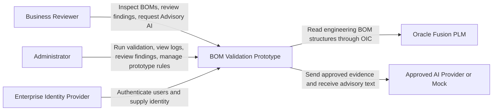
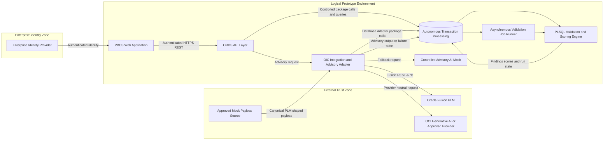
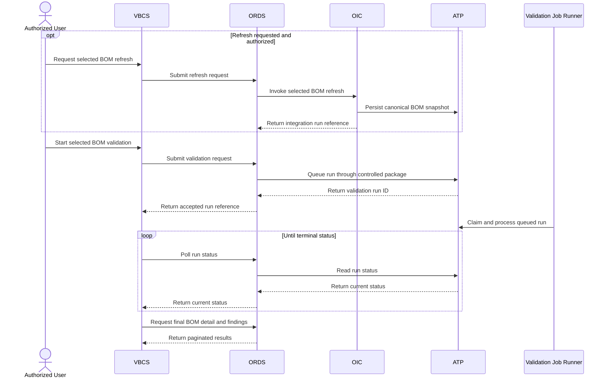
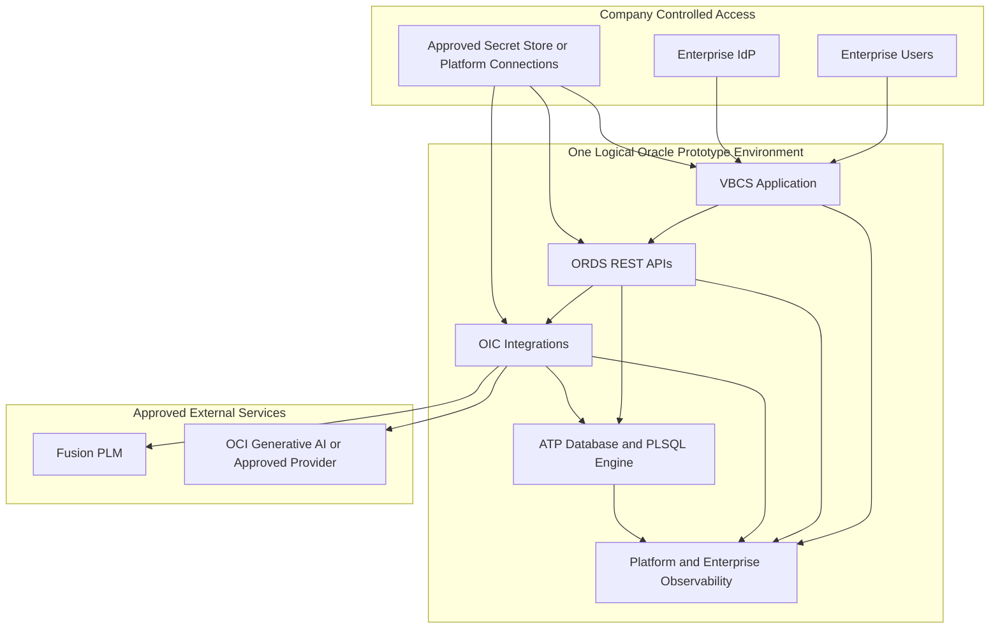
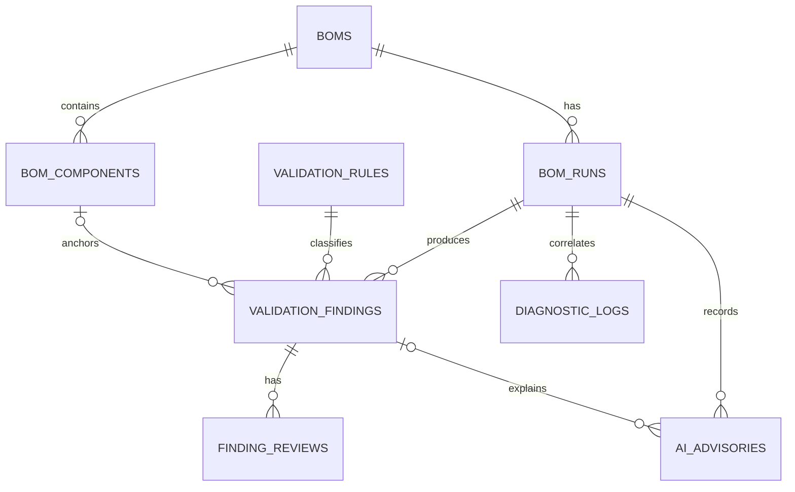

# Technical Design - BOM Validation and Anomaly Detection Prototype

## Document Control

| Field | Value |
| --- | --- |
| Project | BOM Validation and Anomaly Detection Prototype |
| Document ID | TDD-BOM-001 |
| Version | 1.1 - Final UI-Aligned Normalized Technical Design Review Draft |
| Date | 2026-07-21 |
| AIDLC phase | Inception |
| AIDLC stage | Application Design - Consolidated Technical Design |
| Part I status | Approved on 2026-07-16 |
| Part II status | Normalized to eight final UI-aligned prototype tables; awaiting final Technical Design approval |
| Primary inputs | `final.html`, approved requirements, user stories, personas, execution plan, application-design decisions, and customer discovery transcript |

## How to Read This Document

Part I defines the system architecture, component boundaries, high-level interfaces,
orchestration, security, reliability, and deployment context. Part II defines the
UI-aligned data model. The evaluator-approved `final.html` is the latest product truth
and supersedes earlier design choices where they conflict.

# Part I - Architectural Design

## 1. Purpose and Scope

The prototype identifies data-quality, structural, and quantity-anomaly risks in
multi-level engineering BOMs before release. It provides transparent findings and
health scores, supports human review, and offers separately labeled advisory AI
assistance. It does not modify authoritative Oracle Fusion PLM data.

The approved runtime UI has two application roles: Administrator and Business
Reviewer. Engineers and support users remain stakeholder perspectives, but their
prototype capabilities are represented through those two UI roles.

### 1.1 Architectural Goals

- Deliver the complete Must-have journey within the three-week prototype constraint.
- Keep Fusion PLM access behind OIC and serve application views from ATP through ORDS.
- Keep deterministic validation and scoring authoritative, explainable, and independent
  of AI availability.
- Preserve the latest multi-level BOM structure plus run, finding, review, AI, and
  diagnostic history for review and demonstration.
- Enforce enterprise identity, explicit roles, least privilege, and correlated diagnostics.
- Permit live Fusion data or a customer-approved mock payload through one canonical
  ingestion boundary.

### 1.2 Scope Boundaries

In scope are OIC ingestion, ATP persistence and PL/SQL validation, ORDS APIs, VBCS
screens, daily and selected-BOM validation, review history, diagnostics, and advisory
AI. The architecture excludes automatic Fusion PLM write-back, AI-driven decisions,
notifications, manufacturing BOMs, arbitrary file uploads, complex black-box ML, and
production-readiness or SLA claims.

Should and Could capabilities remain subordinate to the final UI. Filtering,
transparent scoring, tree-style component display, readable rule metadata, and
prototype rule creation are represented at the depth shown in `final.html`.

## 2. Architectural Drivers and Constraints

| Driver or constraint | Architectural response |
| --- | --- |
| Oracle-native prototype | Use Fusion PLM, OIC, ATP, ORDS, and VBCS as the principal platform boundaries. |
| Three-week delivery | Prefer a modular monolith in ATP/ORDS plus focused OIC integrations rather than independently deployed microservices. |
| Multi-level BOM validation | Persist a reconstructable graph and execute deterministic traversal in ATP PL/SQL. |
| No direct dashboard calls to Fusion | VBCS reads ATP-backed ORDS APIs; OIC is the only PLM ingestion boundary. |
| Explainability | Persist rule evidence, current score deductions, run history, review history, and AI output links. |
| Human control | Findings require review; AI is labeled, untrusted, and non-authoritative. |
| Prototype volume | Design for a few hundred BOMs with batching and paginated retrieval; exact component volume remains TBD. |
| Enterprise security | Use enterprise IdP sign-in, propagated identity, role mapping, encryption, approved secret storage, and object-level authorization. |
| Incomplete environment details | Treat schedules, retention, timeout values, volume, endpoint names, and tenancy-specific configuration as implementation inputs. |

## 3. System Context

### Text Alternative

- Business Reviewers inspect BOMs, evidence, scores, history, and advisory AI output.
- Administrators refresh PLM data through OIC, run validation, inspect redacted logs,
  review findings, and manage prototype-level rule metadata.
- The enterprise IdP authenticates human users.
- The prototype reads BOM structures from Fusion PLM through OIC and never writes
  validation or AI results back to Fusion PLM.
- The prototype sends only approved evidence to an AI provider or controlled mock and
  treats the response as advisory content.

## 4. Oracle Component Architecture

### Text Alternative

1. The enterprise IdP authenticates a user accessing VBCS.
2. VBCS calls authenticated ORDS APIs; it does not access ATP or Fusion directly.
3. ORDS exposes controlled ATP queries and PL/SQL package operations.
4. OIC retrieves Fusion PLM data or accepts an approved canonical mock payload and
   persists it through controlled ATP operations.
5. Scheduled and user-initiated requests create asynchronous validation runs in ATP.
6. The validation job runner invokes the PL/SQL validation and scoring engine, which
   stores findings, evidence, scores, and run status in ATP.
7. OIC implements the provider-neutral Advisory AI Adapter and calls OCI Generative AI,
   another approved provider, or a controlled mock. AI failure does not affect completed
   deterministic results.

## 5. Component Catalog and Boundaries

| Component | Purpose and responsibilities | Explicit boundary |
| --- | --- | --- |
| VBCS Web Application | Dashboard, BOM detail, multi-level component display, PLM refresh action, validation initiation, run history, finding review, readable rules, Advisory AI request, and Administrator-only diagnostics screens matching `final.html` plus the approved refresh-button update. | Calls only authenticated ORDS APIs; contains no authoritative rule logic and never queries Fusion directly. |
| ORDS API Layer | Presents versioned REST resources, validates requests, propagates identity and correlation IDs, enforces role and object access, invokes approved ATP packages, and shapes paginated responses. | No PLM integration logic; no AI decision-making; no unrestricted SQL exposure. |
| OIC Ingestion Orchestrator | Runs scheduled snapshot or incremental synchronization, supports authorized selected-BOM refresh, maps live and mock inputs to one canonical contract, records integration status, and prevents validation of incomplete loads. | Only integration boundary to Fusion PLM; does not implement deterministic rule semantics. |
| OIC Advisory AI Adapter | Accepts a provider-neutral advisory request, applies approved field selection, calls the configured AI provider or controlled mock, and persists output or a failure outcome. | AI content cannot execute commands, change finding status, calculate authoritative results, or write to Fusion. |
| ATP Persistence Boundary | Stores latest BOM structures, validation runs, findings, review history, current scores, Advisory AI outputs, and redacted operational metadata. | Detailed logical and physical models are defined in Part II. Direct end-user database access is prohibited. |
| PL/SQL Validation and Scoring Engine | Executes deterministic rules, cycle detection, threshold anomaly checks, evidence creation, and transparent scoring against a complete staged scope. | Authoritative processing is independent of AI; detailed algorithms belong to later Functional Design. |
| Asynchronous Validation Job Runner | Claims queued runs, invokes validation packages, updates lifecycle state, isolates failure by run or BOM, and preserves earlier successful results. | Exact ATP scheduling mechanism and concurrency settings are implementation inputs. |
| Enterprise Identity Provider | Authenticates users and supplies identity attributes or group membership used for application-role mapping. | Exact IdP product, token claims, and group names are environment inputs. |
| Oracle Fusion PLM | Authoritative source of engineering BOM structures and attributes. | Read-only from this prototype; no validation, review, or AI write-back. |
| Advisory AI Provider or Mock | Returns BOM-level summaries, selected-finding explanations, and suggested actions based on supplied stored evidence. | Non-authoritative and optional at runtime; provider output is untrusted. |
| Observability Facilities | Collect structured logs, correlations, and applicable latency, error, throughput, and saturation metrics from each platform component. | Must redact secrets and sensitive payload content; exact enterprise tooling is TBD. |

## 6. High-Level Component Interfaces

The following logical signatures define responsibility and input/output types without
fixing REST payload schemas or database structures.

| Interface | Logical operation | Input type | Output type | Purpose |
| --- | --- | --- | --- | --- |
| Ingestion Service | `startSync(request)` | `SyncRequest` | `IntegrationRunReference` | Start a scheduled snapshot or incremental load. |
| Ingestion Service | `refreshBom(request)` | `BomRefreshRequest` | `IntegrationRunReference` | Refresh one authorized BOM or dashboard dataset through the same canonical OIC ingestion path. |
| Ingestion Service | `getIntegrationRun(runId)` | `RunIdentifier` | `IntegrationRunView` | Return status, counts, timing, source mode, and redacted errors. |
| Validation Orchestrator | `startValidation(request)` | `ValidationRequest` | `ValidationRunReference` | Queue a daily or selected-BOM validation and return immediately with a run ID. |
| Validation Orchestrator | `getValidationRun(runId)` | `RunIdentifier` | `ValidationRunView` | Return asynchronous run status and summary. |
| Validation Engine | `execute(runContext)` | `ValidationRunContext` | `ValidationOutcome` | Execute enabled rules and scoring for the staged scope. |
| Query Service | `getDashboard(query)` | `DashboardQuery` | `PagedDashboardView` | Return aggregated health and finding information. |
| Query Service | `getBomDetail(bomId, query)` | `BomIdentifier`, `DetailQuery` | `BomDetailView` | Return multi-level relationships and associated findings. |
| Query Service | `getBomHistory(bomId, query)` | `BomIdentifier`, `HistoryQuery` | `PagedRunHistoryView` | Return comparable historical run results. |
| Review Service | `changeFindingStatus(command)` | `FindingStatusCommand` | `FindingView` | Enforce review transitions, comment rules, audit, and score refresh. |
| Rule Catalog Service | `getRules(query)` | `RuleQuery` | `RuleCatalogView` | Expose readable active rule metadata and thresholds. |
| Rule Catalog Service | `addPrototypeRule(command)` | `RuleCommand` | `RuleCatalogView` | Prototype Administrator action represented by the Add New Logic Rule UI. |
| Advisory AI Service | `requestFindingExplanation(request)` | `FindingAdvisoryRequest` | `AdvisoryRequestReference` | Request a labeled explanation for persisted evidence. |
| Advisory AI Service | `requestBomSummary(request)` | `BomAdvisoryRequest` | `AdvisoryRequestReference` | Request a labeled BOM-level summary from stored findings and health-score evidence. |
| Advisory AI Service | `getAdvisoryResult(requestId)` | `AdvisoryRequestIdentifier` | `AdvisoryResultView` | Return advisory output, pending state, or isolated failure. |
| Diagnostics Service | `getDiagnostics(query)` | `DiagnosticQuery` | `PagedDiagnosticView` | Return Administrator-only redacted operational diagnostics. |

Detailed fields and validation constraints for these abstract types are deferred to
Part II or later per-unit Functional Design.

## 7. Service Orchestration and End-to-End Flows

### 7.1 Scheduled or Incremental Ingestion

1. OIC creates an integration run and correlation ID.
2. OIC reads Fusion PLM through approved REST operations. If access is blocked, it
   processes the approved mock through the same canonical mapping.
3. OIC validates the envelope and required ingestion structure, maps it to the
   canonical payload, and calls controlled ATP persistence operations in batches.
4. ATP records the staged snapshot or incremental change set and ingestion metadata.
5. Only after the complete unit of ingestion succeeds does OIC mark the data eligible
   for validation. Partial or invalid input is marked failed and is not validated.
6. OIC records counts, timing, source mode, completion status, and redacted error detail.

### 7.1A UI-Initiated Refresh

1. An Administrator clicks Refresh beside Run Validation.
2. VBCS sends a refresh request to ORDS with the selected BOM or dashboard refresh
   scope.
3. ORDS authorizes the Administrator and invokes the OIC refresh integration.
4. OIC pulls refreshed PLM-shaped data from Fusion PLM or the approved mock source.
5. ATP updates the latest `BOMS` and `BOM_COMPONENTS` state only after the refresh unit
   is accepted, and records an integration run in `BOM_RUNS`.
6. VBCS reloads dashboard and BOM detail data from ATP through ORDS.
7. If refresh fails, prior dashboard/detail data remains usable and a correlated,
   redacted diagnostic log is retained.

### 7.2 Daily Validation

1. The configured OIC schedule starts once daily at a TBD time.
2. OIC requests a validation run through the ATP validation package and receives a
   unique run ID.
3. The asynchronous job runner claims the run and executes all enabled rules against
   each complete staged BOM in scope.
4. The engine persists findings and evidence, calculates health-score deductions, and
   records per-BOM and overall outcomes.
5. A failed BOM or run receives actionable diagnostics without deleting earlier
   successful results.
6. Administrators inspect status through ORDS-backed VBCS views.

### 7.3 Selected-BOM Refresh and Validation

#### Text Alternative

An authorized Administrator may first request a selected-BOM refresh, which ORDS routes
to OIC for canonical ingestion. The Administrator then starts validation through VBCS
and ORDS. ATP queues the work and immediately returns a run ID. The validation job
runner processes the run asynchronously while VBCS polls ORDS until completion, then
retrieves the final detail and findings.

### 7.4 Dashboard, Detail, Review, and History

1. VBCS requests paginated dashboard information from ORDS.
2. ORDS applies identity, role, object-level access, filters, sorting, and page limits
   before reading ATP-backed views or controlled query packages.
3. A user opens a BOM to see all supplied hierarchy levels, findings, evidence, current
   score, and history links.
4. A Business Reviewer or Administrator changes a finding to Open, Reviewed, or Ignored
   in the UI.
5. The Review Service rejects Ignored without a non-empty comment, stores the actor and
   timestamp for accepted transitions, and requests score recalculation.
6. `Resolved` may appear in loaded/current data when supplied by PLM or system
   reconciliation, but it is not exposed as a manual review action in the prototype UI.
7. The interface continues to label findings as review aids rather than proof of error.

### 7.5 Advisory AI

1. A user requests a BOM-level summary from BOM Detail or an explanation for a
   persisted finding.
2. ORDS authenticates the user and supplies only approved, stored evidence to the OIC
   Advisory AI Adapter; arbitrary instructions or database access are not supplied.
3. The adapter constructs a provider-neutral request and calls the preferred OCI
   Generative AI deployment, another approved provider, or the controlled mock.
4. The response is treated as untrusted text, safely encoded, labeled `Advisory AI`,
   linked to its source evidence, and persisted only in ATP.
5. Timeout, retry exhaustion, or provider rejection creates a correlated AI failure
   outcome. Deterministic findings, scores, history, and review remain available.
6. No output or generated comment is sent to Fusion PLM or used to execute a command.

## 8. High-Level REST and Operation Catalog

Paths are proposed logical resources for design consistency. Final URI names, payloads,
status codes, and schemas are implementation decisions.

| Method and logical resource | Purpose | Typical roles | Behavior |
| --- | --- | --- | --- |
| `GET /dashboard` | Health, risk, severity, open-finding, and item-class summaries | Reviewer, Admin | Paginated or bounded aggregate result. |
| `GET /boms` | Search, filter, and sort authorized BOM summaries | Reviewer, Admin | Object-authorized and paginated. |
| `GET /boms/{bomId}` | Multi-level BOM detail, score, findings, and evidence | Reviewer, Admin | Reads ATP only. |
| `GET /boms/{bomId}/runs` | Comparable validation and refresh history | Reviewer, Admin | Paginated or bounded. |
| `POST /boms/{bomId}/refresh` | Pull refreshed PLM data through OIC and update dashboard/detail data from ATP | Admin | Returns an asynchronous integration-run reference; prior data remains usable on failure. |
| `POST /dashboard/refresh` | Pull refreshed dashboard dataset through OIC when the UI refresh is scoped beyond one BOM | Admin | Optional broader refresh endpoint if implementation chooses dashboard-wide refresh. |
| `POST /validation-runs` | Start selected-BOM validation | Admin | Returns `202 Accepted` semantics with a run ID. |
| `GET /validation-runs/{runId}` | Poll run status and summary | Reviewer, Admin | Object- and role-authorized. |
| `PATCH /findings/{findingId}/status` | Record Open, Reviewed, or Ignored status and comment | Reviewer, Admin | Ignored requires a non-empty comment; Resolved is not a manual UI transition. |
| `GET /rules` | Read rule names, descriptions, severity, state, and thresholds | Reviewer, Admin | Readable configuration only. |
| `POST /rules` | Add prototype logic rule if implemented beyond static demo data | Admin | Prototype-level action aligned with final UI. |
| `POST /boms/{bomId}/advisories` | Request a BOM-level advisory summary | Reviewer, Admin | Uses the latest validation run, findings, and score evidence. |
| `POST /findings/{findingId}/advisories` | Request an advisory explanation | Reviewer, Admin | Returns an advisory request reference. |
| `GET /advisories/{requestId}` | Retrieve labeled output or failure | Requester, Reviewer, Admin | Safely encoded; never authoritative. |
| `GET /diagnostics/runs` | Search redacted integration, validation, API, or AI diagnostics | Admin | Least-privilege operational view. |

OIC-to-ATP calls use the Oracle Database Adapter and allow-listed PL/SQL package
operations. OIC-to-Fusion uses approved Item Structures REST operations. Service names,
connection identifiers, and concrete resource versions remain environment inputs.

## 9. Component Dependencies and Communication

### 9.1 Dependency Matrix

| Consumer | Dependency | Communication | Coupling control |
| --- | --- | --- | --- |
| VBCS | Enterprise IdP | Enterprise authentication flow | Identity claims mapped to application roles. |
| VBCS | ORDS | Authenticated HTTPS REST | Versioned resources and abstract view contracts. |
| ORDS | ATP | Controlled packages, views, and queries | Allow-listed operations; no end-user SQL. |
| ORDS | OIC Advisory AI Adapter | Authenticated service call | Provider-neutral advisory contract. |
| OIC Ingestion | Fusion PLM | Authenticated REST | Canonical mapping isolates source contract changes. |
| OIC Ingestion | Approved mock source | Controlled PLM-shaped payload | Same canonical contract as live input. |
| OIC | ATP | Oracle Database Adapter | Package boundary and correlation ID. |
| Job Runner | Validation Engine | Internal ATP invocation | Run-context contract and transaction boundaries. |
| Validation Engine | ATP Persistence | PL/SQL persistence operations | No AI dependency. |
| OIC AI Adapter | AI provider or mock | Authenticated provider call | Provider adapter and allow-listed fields. |
| All components | Observability facilities | Structured logs and metrics | Shared correlation ID and redaction policy. |

### 9.2 Dependency Principles

- VBCS depends on API contracts, not ATP structures.
- ORDS depends on controlled ATP packages and query boundaries, not unrestricted tables.
- Validation depends only on staged data and approved configuration, never on AI.
- OIC isolates Fusion and AI provider contracts from UI and domain processing.
- No component other than OIC communicates with Fusion PLM.
- All cross-boundary calls carry or create a correlation identifier.

## 10. Validation, Anomaly, Scoring, and Review Boundaries

The PL/SQL engine owns the final UI rule catalog: six deterministic rule families,
circular-path detection, quantity-threshold anomaly evaluation, evidence generation,
and score calculation. Rule details and thresholds are readable and their supported
configuration is controlled.

The engine produces authoritative application findings, not authoritative PLM truth.
Reviewers decide whether a finding is Open, Reviewed, or Ignored. `Resolved` may exist
as imported/current data from PLM or system reconciliation, but is not a manual UI
choice. AI may restate evidence or suggest action but cannot create deterministic
findings, change status, alter scoring, select a substitute, or make a release decision.

Detailed algorithms, transaction boundaries, cycle-traversal strategy, duplicate
normalization, and score-recalculation logic belong to later per-unit Functional Design.

## 11. Security and Trust Design

### 11.1 Trust Boundaries

- **External source boundary**: Fusion and mock payloads are untrusted inputs and are
  schema- and business-envelope validated by OIC before persistence.
- **User boundary**: VBCS obtains enterprise authentication; ORDS independently validates
  the presented identity and authorization for each operation.
- **Database boundary**: ATP is reached through allow-listed OIC and ORDS operations;
  business users receive no unrestricted database access.
- **AI boundary**: Prompt inputs are allow-listed, provider output is untrusted and
  encoded, and no AI response can invoke tools or mutate authoritative state.
- **Operational boundary**: secrets and sensitive payload content are excluded or
  redacted from logs, user messages, and AI inputs.

### 11.2 Role-to-Capability Mapping

| Capability | Business Reviewer | Administrator |
| --- | --- | --- |
| View authorized dashboard and BOM detail | Yes | Yes |
| Refresh PLM data through OIC | No | Yes |
| Start selected-BOM validation | No | Yes |
| Change finding status to Open, Reviewed, or Ignored | Yes | Yes |
| Manually set Resolved | No | No |
| Request advisory explanation | Yes | Yes |
| View run history | Yes | Yes |
| View redacted integration logs | No | Yes |
| View readable rule metadata | Yes | Yes |
| Add prototype logic rule or configure schedule | No | Yes |

One person may hold multiple roles, but permissions remain additive and explicit. Exact
enterprise groups, token claims, and object-authorization rules are implementation
inputs.

### 11.3 Security Controls

- TLS protects every network interface; ATP encryption at rest remains enabled.
- Credentials, tokens, keys, and connection secrets use the company-approved secret
  store or platform connection facility and never appear in source or logs.
- ORDS validates input, safely encodes output, applies pagination bounds, and enforces
  role plus BOM-level access before invoking domain operations.
- OIC validates source payloads and does not persist a partial dataset as eligible for
  validation.
- AI requests contain the minimum approved evidence; sensitive fields are excluded or
  redacted before transmission.
- Status and configuration changes create attributable audit events.
- Error responses are non-sensitive and carry a supportable correlation identifier.

## 12. Reliability, Error Handling, and Observability

| Concern | Architectural treatment |
| --- | --- |
| Asynchronous work | Every ingestion, validation, and advisory request has a unique reference and explicit lifecycle state. |
| Timeouts | All Fusion, ATP adapter, ORDS, and AI calls use explicit configured timeouts; numeric values are TBD. |
| Retries | Retry only transient failures with bounded attempts and backoff; validation or authorization errors are not retried. |
| Idempotency | Replayed integration or command requests use a run or request identity to prevent unintended duplicate processing; exact keys are defined later. |
| Partial ingestion | Mark the integration run failed and keep the incomplete snapshot ineligible for validation. |
| Validation failure | Record run or BOM failure without deleting prior successful history; expose redacted actionable diagnostics. |
| AI failure | Persist or log the isolated failure and keep all deterministic functions available. |
| Correlation | Propagate a correlation ID across VBCS, ORDS, OIC, ATP, and AI operations where supported. |
| Logging | Use structured events with component, operation, stage, run/reference ID, outcome, timing, and redacted error classification. |
| Metrics | Capture applicable latency, error rate, throughput, and saturation indicators; concrete dashboards and thresholds are TBD. |
| Retention | Retain enough history for the acceptance journey; final data and log retention periods are TBD. |

## 13. Logical Deployment View

### Text Alternative

The prototype uses one logical environment. Enterprise users authenticate through the
company IdP and access VBCS. VBCS calls ORDS, while ORDS and OIC use controlled ATP
interfaces. Only OIC communicates with Fusion PLM and the configured AI provider. Each
Oracle component uses approved secret storage or platform connections and emits
redacted operational telemetry. This is a logical view and does not claim separate
development/test environments, production network topology, high availability, RTO,
RPO, or production SLA readiness.

## 14. Architectural Decisions

| ID | Decision | Rationale | Rejected or deferred alternative |
| --- | --- | --- | --- |
| ADR-001 | Execute deterministic validation, cycle detection, anomaly checks, and scoring in ATP PL/SQL. | Keeps data-intensive, authoritative processing close to staged data and OIC focused on orchestration. | Rule implementation primarily in OIC or a separately deployed validation service. |
| ADR-002 | Use a provider-neutral OIC Advisory AI Adapter with OCI Generative AI preferred and a controlled mock fallback. | Isolates provider availability and keeps the demo usable when access is blocked. | Direct provider coupling or mock-only design. |
| ADR-003 | Use enterprise IdP authentication with propagated identity and two explicit UI roles: Business Reviewer and Administrator. | Aligns user access with the evaluator-approved UI and supports least privilege. | Prototype-local credentials as the primary identity model. |
| ADR-004 | Support scheduled snapshot or incremental sync plus Administrator UI refresh through one canonical OIC payload. | Supports regular operation and evaluator-requested refresh behavior without direct VBCS-to-Fusion access. | Daily full-load-only or direct UI-time PLM retrieval. |
| ADR-005 | Run validation asynchronously and return a run ID for ORDS polling. | Avoids long request blocking and gives both scheduled and UI runs one lifecycle model. | Synchronous validation calls. |
| ADR-006 | Model one logical prototype environment using existing Oracle services. | Matches the approved prototype depth and avoids unsupported production-readiness claims. | Detailed multi-environment promotion topology. |
| ADR-007 | Use an ATP/ORDS modular-monolith boundary with OIC integrations rather than new microservices. | Reduces deployment and operational overhead within three weeks while retaining logical component separation. | Independently deployed custom services. |
| ADR-008 | Keep Fusion PLM read-only for the prototype. | Preserves human control and avoids authoritative-data risk. | Automatic remediation or AI write-back. |
| ADR-009 | Align the physical data model to `final.html` and store latest BOM structure with retained runs, findings, review history, AI output, and diagnostics. | Matches the evaluator-approved prototype and reduces table count for the three-week scope. | Twenty-one-table normalized schema with immutable BOM versions and separate score/audit/AI tables. |

## 15. Assumptions, Dependencies, Risks, and Limitations

### 15.1 Assumptions and Dependencies

- Fusion PLM access or a customer-approved mock payload will be available.
- OIC, ATP, ORDS, VBCS, enterprise identity, approved secret storage, and an approved
  AI option will be accessible within the prototype schedule.
- Customer-provided lifecycle values and reviewed acceptance fixtures will define the
  obsolete-status and anomaly demonstrations.
- The final approved UI is `final.html`; it supersedes prior design assumptions where
  conflicts exist.
- The Fusion payload supplies enough identifiers and paths to reconstruct the latest
  multi-level BOM; exact fields are resolved in Part II.
- OCI Generative AI is preferred, but provider access and model choice are deployment
  inputs rather than requirements.

### 15.2 Risks and Mitigations

| Risk | Effect | Architectural mitigation |
| --- | --- | --- |
| Oracle environment or Fusion access delay | Blocks live end-to-end integration | Use the approved mock through the identical OIC canonical boundary. |
| Combined Must scope exceeds three weeks | Incomplete evaluator journey | Protect Must flows; defer Could UI and advanced visualization first. |
| Dirty or sparse quantity history | Weak anomaly demonstration | Use explainable configured thresholds and a customer-reviewed fixture. |
| Very deep or cyclic BOMs | Expensive graph traversal | Bound work per run, preserve cycle-path evidence, and measure with acceptance data; exact guardrails are TBD. |
| Identity claim or object-access details arrive late | Delays secured APIs | Keep role mapping and authorization policy configurable; obtain claims and access rules before implementation. |
| AI access, timeout, or unsafe output | Advisory feature unavailable or misleading | Provider adapter, controlled mock, output encoding, visible advisory label, evidence linking, and graceful degradation. |
| Unknown volume, retention, and response targets | Premature performance claims | Capture observed prototype metrics and leave production sizing to later planning. |

### 15.3 Known Limitations and Open Implementation Inputs

- Daily execution time, incremental cursor strategy, batch size, and source API version.
- Exact component volume, pagination defaults and maximums, response-time goals, timeout
  values, retry limits, and concurrency limits.
- Data and log retention periods and enterprise observability destination.
- Enterprise IdP product, identity claims, group mappings, and BOM-level access policy.
- AI model, endpoint, approved input fields, safety configuration, and mock activation
  control.
- ATP job-runner mechanism, network topology, DNS, certificates, connection names, and
  environment-specific secrets.

## 16. Traceability

| Architecture area | Requirements | User stories |
| --- | --- | --- |
| OIC ingestion, UI refresh, canonical payload, staging, and run diagnostics | FR-001, FR-002, FR-003, FR-004, FR-035, FR-039; NFR-001, NFR-005, NFR-009 | US-001, US-008 |
| Scheduled and selected validation orchestration | FR-005, FR-006, FR-007 | US-004, US-010 |
| Deterministic engine and multi-level graph processing | FR-008, FR-009, FR-010, FR-011, FR-012, FR-013 | US-002 |
| Quantity anomaly and transparent health score | FR-014, FR-015, FR-016, FR-017 | US-003, US-012 |
| Results, status review, score refresh, and history | FR-018, FR-019, FR-020, FR-021; NFR-004 | US-006 |
| ORDS APIs, VBCS dashboard, detail, filtering, and tree option | FR-022, FR-023, FR-024, FR-025, FR-026; NFR-002, NFR-003 | US-005, US-011, US-013 |
| Provider-neutral advisory AI and graceful degradation | FR-027, FR-028, FR-029, FR-030, FR-031; NFR-007, NFR-009 | US-007 |
| Roles, readable rules, configuration, and Administrator diagnostics | FR-032, FR-033, FR-034, FR-035; NFR-005, NFR-006, NFR-008 | US-008, US-014 |
| Acceptance dataset and complete demonstration | FR-036, FR-037 | US-009 |

The final UI-aligned active MVP scope is represented. Earlier FR-038 is excluded from
the final UI-aligned prototype unless a future UI revision reintroduces it.

## 17. Technology References

- Oracle Fusion Cloud SCM REST API for Item Structures:
  <https://docs.oracle.com/en/cloud/saas/supply-chain-and-manufacturing/25c/fasrp/api-product-lifecycle-management-item-structures.html>
- Oracle Integration Oracle Database Adapter stored-procedure invocation:
  <https://docs.oracle.com/en/cloud/paas/application-integration/database-adapter/invoke-stored-procedure-page.html>
- OCI Generative AI overview:
  <https://docs.oracle.com/en-us/iaas/Content/generative-ai/overview.htm>

These references confirm platform capabilities only. Tenancy-specific availability,
versions, endpoints, licenses, and access remain implementation inputs.

# Part II - Data Models

## 18. Scope and Modeling Decisions

Part II defines the conceptual, logical, and proposed Oracle ATP physical model for
the evaluator-approved prototype UI in `final.html`. This pass supersedes the earlier
21-table normalized model. It remains documentation only; it does not create DDL,
application code, OIC packages, ORDS modules, VBCS artifacts, infrastructure, or
external-system writes.

The approved UI is now a primary product truth. Therefore the data model deliberately
uses a compact but normalized prototype shape:

- Store the latest BOM structure only for each BOM.
- Retain runs, findings, review history, AI output, rule metadata, and redacted
  diagnostics in separate focused structures.
- Keep Fusion PLM read-only.
- Treat deterministic validation as authoritative and AI as advisory.
- Keep `Resolved` available as an incoming or current source/result state, but do not
  expose `Resolved` as a manual review action in the prototype UI.

### 18.1 Normalization Revision

The earlier final UI-aligned pass compressed the data model into four core tables plus
optional support structures. That was simple, but it made `VALIDATION_RUNS` and
`VALIDATION_FINDINGS` carry too many unrelated responsibilities. The approved revision
uses eight prototype tables, roughly aligned to 3NF:

| Earlier compact concern | Normalized outcome |
| --- | --- |
| BOM history | Latest BOM structure remains in `BOMS` and `BOM_COMPONENTS`; prior structural snapshots remain out of scope. |
| Run history | Import, refresh, validation, and advisory activity is retained in `BOM_RUNS`. |
| Review history | Review transitions move from embedded JSON into `FINDING_REVIEWS`. |
| Rule catalog | Rule definitions move into `VALIDATION_RULES`. |
| Score evidence | Current score remains on `BOMS`; run-time score evidence is retained in `BOM_RUNS` and derived from findings. |
| AI records | BOM-level summaries and finding-level explanations move into `AI_ADVISORIES`. |
| Diagnostics | Redacted operational events are retained in `DIAGNOSTIC_LOGS`. |

This model intentionally stops at eight tables. It avoids the earlier 21-table
enterprise-style design while reducing column bloat and improving audit/reporting
clarity.

### 18.2 Naming Conventions

- Table names are uppercase plural names matching the prototype UI terminology.
- Primary keys end in `_ID`.
- Foreign keys reuse the parent key name.
- Source identifiers from Fusion PLM are preserved as business columns, not primary keys.
- Flexible evidence and optional source attributes use validated JSON only where the
  structure is naturally variable.
- Timestamps use `TIMESTAMP(6) WITH TIME ZONE` and are persisted in UTC by controlled
  packages.

## 19. Conceptual Data Model

| Concept | Business meaning | Prototype lifecycle |
| --- | --- | --- |
| BOM | Latest known engineering BOM header and health summary from Fusion PLM or approved mock data. | Upserted by ingestion; current values are visible in the UI. |
| BOM Component | One parent-child component relationship in the latest BOM structure. | Replaced or refreshed as part of an accepted import for the BOM. |
| BOM Run | One import, UI refresh, scheduled validation, on-demand validation, or Advisory AI execution record. | Retained for execution history and comparison. |
| Validation Finding | One rule or anomaly result produced by a validation run. | Retained with current issue state and evidence. |
| Finding Review | One human review transition or comment against a finding. | Appended whenever a reviewer changes status or records a review decision. |
| Validation Rule | Readable validation rule catalog shown in the Rules view. | Seeded or controlled configuration; full authoring is prototype-limited. |
| AI Advisory | One BOM-level summary or selected-finding explanation. | Retained separately from deterministic findings and review state. |
| Diagnostic Log | Redacted operational event with correlation ID and processing stage. | Retained long enough for the evaluator journey and troubleshooting. |

## 20. Logical Entity-Relationship Model

### Text Alternative

A BOM contains many component rows and many execution runs. A run can represent import,
refresh, validation, or Advisory AI work. Validation runs produce findings, each finding
is classified by one validation rule, and a finding may anchor to a component row when
the issue is component-specific. Human review transitions are stored as child rows of
findings. Advisory AI output is stored separately and may apply either to a whole BOM
run or to a selected finding. Diagnostic logs correlate to runs and optionally to
findings.

## 21. Logical Entity Catalog

| Entity | Ownership and key relationships | Important behavior |
| --- | --- | --- |
| BOMS | Parent of BOM_COMPONENTS and BOM_RUNS. | Stores latest header, source identifiers, current health score, and status label. |
| BOM_COMPONENTS | Child of BOMS. | Stores multi-level parent-child relationship data, quantity, UOM, status, effectivity, path, and anomaly thresholds. |
| BOM_RUNS | Child of BOMS. | Stores import, refresh, validation, and advisory execution metadata with trigger, status, counts, health score, error detail, idempotency key, and correlation ID. |
| VALIDATION_RULES | Parent/reference for VALIDATION_FINDINGS. | Stores readable deterministic rule definitions, severities, descriptions, and enabled state. |
| VALIDATION_FINDINGS | Child of BOM_RUNS, VALIDATION_RULES, and optional child of BOM_COMPONENTS. | Stores deterministic result, evidence, and current issue status only. |
| FINDING_REVIEWS | Child of VALIDATION_FINDINGS. | Stores normalized review transition history, comments, reviewer, and timestamp. |
| AI_ADVISORIES | Child of BOM_RUNS and optional child of VALIDATION_FINDINGS. | Stores BOM-level summaries and selected-finding explanations without mutating rules, findings, scores, or PLM. |
| DIAGNOSTIC_LOGS | Child of BOM_RUNS and optional child of VALIDATION_FINDINGS. | Stores redacted integration, validation, API, and AI events for troubleshooting. |

## 22. Oracle ATP Physical Conventions

| Convention | Proposed implementation |
| --- | --- |
| Surrogate key | `NUMBER(19)` generated by identity or an approved sequence. |
| External identifier | `VARCHAR2(200 CHAR)` unless the verified source contract requires more. |
| Short code or status | `VARCHAR2(30 CHAR)` to `VARCHAR2(100 CHAR)` with checks for controlled values. |
| Human-readable text | `VARCHAR2(200 CHAR)` for names and `VARCHAR2(1000 CHAR)` for descriptions. |
| Quantity | `NUMBER(28,10)` and nullable so invalid source values remain testable. |
| Score | `NUMBER(5,2)` with a `0` to `100` check. |
| Timestamp | `TIMESTAMP(6) WITH TIME ZONE`, normalized to UTC. |
| Flexible evidence | `CLOB` with `IS JSON`; native Oracle `JSON` may replace it after ATP-version confirmation. |
| Long safe output | `CLOB`, safely encoded when returned to the UI. |

## 23. ATP Table and Column Catalog

The approved physical model uses eight normalized prototype tables. These tables still
map cleanly to the final UI, but remove the earlier bloat from run, finding, review,
AI, rule, and diagnostic columns.

#### BOMS

| Column | Oracle type | Null | Key or constraint | Purpose |
| --- | --- | --- | --- | --- |
| BOM_ID | NUMBER(19) | No | PK | Internal BOM identity. |
| BILL_SEQUENCE_ID | VARCHAR2(200 CHAR) | Yes | Indexed | Preserved Fusion structure or bill sequence identifier. |
| ORGANIZATION_CODE | VARCHAR2(100 CHAR) | No | UQ part | Fusion organization context. |
| ITEM_NUMBER | VARCHAR2(200 CHAR) | No | UQ part, indexed | Top-level assembly item number. |
| STRUCTURE_NAME | VARCHAR2(200 CHAR) | No | UQ part | Structure or alternate name, such as `PRIMARY`. |
| DESCRIPTION | VARCHAR2(1000 CHAR) | Yes |  | BOM description shown in the dashboard. |
| EFFECTIVITY_CONTROL | VARCHAR2(100 CHAR) | Yes |  | Source effectivity mode. |
| SOURCE_UPDATED_AT | TIMESTAMP(6) WITH TIME ZONE | Yes |  | Source update timestamp when supplied. |
| IMPORT_BATCH_ID | VARCHAR2(100 CHAR) | Yes | Indexed | Import batch or package identifier. |
| IMPORTED_AT | TIMESTAMP(6) WITH TIME ZONE | No | Indexed | Time this latest structure was imported. |
| ITEM_CLASS | VARCHAR2(200 CHAR) | Yes | Indexed | Header-level class when supplied. |
| HEALTH_SCORE | NUMBER(5,2) | No | CK 0 to 100 | Current calculated health score. |
| STATUS_LABEL | VARCHAR2(30 CHAR) | No | CK `HEALTHY`, `RISKY` | UI status derived from current health score. |

Business uniqueness is `(ORGANIZATION_CODE, ITEM_NUMBER, STRUCTURE_NAME)`. If a stable
Fusion structure identifier is verified, it may be added as an alternate unique key.

#### BOM_COMPONENTS

| Column | Oracle type | Null | Key or constraint | Purpose |
| --- | --- | --- | --- | --- |
| BOM_COMPONENT_ID | NUMBER(19) | No | PK | Internal component relationship identity. |
| BOM_ID | NUMBER(19) | No | FK BOMS, indexed | Owning latest BOM. |
| COMPONENT_SEQUENCE_ID | VARCHAR2(200 CHAR) | Yes | Indexed | Preserved Fusion component sequence identifier. |
| PARENT_ITEM_NUMBER | VARCHAR2(200 CHAR) | No | Indexed | Parent item in the relationship. |
| COMPONENT_ITEM_NUMBER | VARCHAR2(200 CHAR) | No | Indexed | Component item in the relationship. |
| COMPONENT_ITEM_CLASS | VARCHAR2(200 CHAR) | Yes | Indexed | Item class used by dashboard and anomaly thresholding. |
| QUANTITY | NUMBER(28,10) | Yes |  | Raw quantity; null, zero, or negative remains valid staged data for validation. |
| UOM_CODE | VARCHAR2(50 CHAR) | Yes |  | Raw UOM; null or blank remains testable. |
| ITEM_SEQUENCE_NUMBER | NUMBER(10) | Yes | Indexed | Display or source sequence. |
| OPERATION_SEQUENCE | VARCHAR2(100 CHAR) | Yes | Indexed | Operation sequence, including null semantics for duplicate detection. |
| ITEM_STATUS | VARCHAR2(100 CHAR) | Yes | Indexed | Raw lifecycle/status value, including `Obsolete`. |
| EFFECTIVITY_START | TIMESTAMP(6) WITH TIME ZONE | Yes | Indexed | Relationship start date. |
| EFFECTIVITY_END | TIMESTAMP(6) WITH TIME ZONE | Yes | Indexed | Relationship end date, even when invalid. |
| BOM_LEVEL | NUMBER(10) | No | CK at least 1 | Level shown in the multi-level tree/table. |
| COMPONENT_PATH | VARCHAR2(4000 CHAR) | Yes | Indexed | Path used for display and circular-reference evidence. |
| ANOMALY_MIN_QUANTITY | NUMBER(28,10) | Yes |  | Prototype threshold lower bound. |
| ANOMALY_MAX_QUANTITY | NUMBER(28,10) | Yes |  | Prototype threshold upper bound. |
| IMPORTED_AT | TIMESTAMP(6) WITH TIME ZONE | No |  | Component import timestamp. |

No unique constraint prevents duplicate business relationships. Exact duplicates must
remain preservable so FR-010 can detect them.

#### BOM_RUNS

| Column | Oracle type | Null | Key or constraint | Purpose |
| --- | --- | --- | --- | --- |
| RUN_ID | NUMBER(19) | No | PK | Internal execution identity. |
| BOM_ID | NUMBER(19) | No | FK BOMS, indexed | BOM in scope. |
| RUN_KIND | VARCHAR2(30 CHAR) | No | CK `IMPORT`, `REFRESH`, `VALIDATION`, `ADVISORY_AI` | Execution type. |
| TRIGGER_TYPE | VARCHAR2(30 CHAR) | No | CK `OIC`, `UI_REFRESH`, `ON_DEMAND`, `DAILY`, `SCHEDULER`, `USER_AI` | UI/source trigger. |
| STATUS | VARCHAR2(30 CHAR) | No | CK controlled lifecycle | Queued, Running, Completed, Failed, or Cancelled. |
| SOURCE_MODE | VARCHAR2(30 CHAR) | Yes | CK `LIVE`, `MOCK`, `N/A` | Live Fusion, mock, or not applicable. |
| IDEMPOTENCY_KEY | VARCHAR2(200 CHAR) | Yes | Indexed | Replay protection for import or command requests. |
| CORRELATION_ID | VARCHAR2(100 CHAR) | No | UQ | Cross-service trace identifier. |
| REQUESTED_BY | VARCHAR2(200 CHAR) | Yes |  | User, scheduler, or service identity. |
| STARTED_AT | TIMESTAMP(6) WITH TIME ZONE | No | Indexed | Start time. |
| COMPLETED_AT | TIMESTAMP(6) WITH TIME ZONE | Yes |  | Terminal time. |
| INPUT_COUNT | NUMBER(19) | No | CK at least 0 | Records or components evaluated. |
| FINDING_COUNT | NUMBER(19) | No | CK at least 0 | Findings produced by the run. |
| HEALTH_SCORE | NUMBER(5,2) | Yes | CK 0 to 100 | Score at completion, where applicable. |
| ERROR_CODE | VARCHAR2(100 CHAR) | Yes |  | Safe error classification. |
| ERROR_MESSAGE | VARCHAR2(4000 CHAR) | Yes | Redacted | Actionable non-sensitive diagnostic summary. |

`BOM_RUNS` replaces the earlier `VALIDATION_RUNS` name because the same history table
now represents import, refresh, validation, and advisory executions. Run kind separates
the behavior without creating separate execution-history tables.

#### VALIDATION_RULES

| Column | Oracle type | Null | Key or constraint | Purpose |
| --- | --- | --- | --- | --- |
| RULE_ID | NUMBER(19) | No | PK | Internal rule identity. |
| RULE_CODE | VARCHAR2(50 CHAR) | No | UQ | Requirement-backed rule code, such as `FR-008`. |
| RULE_NAME | VARCHAR2(200 CHAR) | No |  | Readable rule name shown in the UI. |
| SEVERITY | VARCHAR2(20 CHAR) | No | CK `CRITICAL`, `HIGH`, `WARNING`, `INFO` | Default severity. |
| DESCRIPTION | VARCHAR2(1000 CHAR) | No |  | Plain-language rule behavior. |
| THRESHOLD_OR_CONFIGURATION | VARCHAR2(1000 CHAR) | Yes |  | Human-readable threshold or configuration summary. |
| ENABLED_FLAG | CHAR(1) | No | CK `Y`, `N` | Whether the rule is active. |
| CREATED_AT | TIMESTAMP(6) WITH TIME ZONE | No |  | Rule creation or seed timestamp. |
| UPDATED_AT | TIMESTAMP(6) WITH TIME ZONE | Yes |  | Last controlled configuration update timestamp. |

#### VALIDATION_FINDINGS

| Column | Oracle type | Null | Key or constraint | Purpose |
| --- | --- | --- | --- | --- |
| FINDING_ID | NUMBER(19) | No | PK | Internal finding identity. |
| RUN_ID | NUMBER(19) | No | FK BOM_RUNS, indexed | Producing validation run. |
| BOM_COMPONENT_ID | NUMBER(19) | Yes | FK BOM_COMPONENTS, indexed | Affected component, if relationship-specific. |
| RULE_ID | NUMBER(19) | No | FK VALIDATION_RULES, indexed | Rule that classified the finding. |
| FINDING_KEY | VARCHAR2(400 CHAR) | No | Indexed | Stable recurrence or evidence key for the prototype. |
| ISSUE_STATUS | VARCHAR2(20 CHAR) | No | CK `OPEN`, `REVIEWED`, `IGNORED`, `RESOLVED` | Current issue status. `RESOLVED` may arrive from PLM/current data, but the UI does not offer it as a manual review action. |
| ACTUAL_VALUE | VARCHAR2(1000 CHAR) | Yes |  | Observed value displayed to the reviewer. |
| EXPECTED_VALUE | VARCHAR2(1000 CHAR) | Yes |  | Expected value or threshold summary. |
| EVIDENCE_JSON | CLOB | No | CK IS JSON | Complete evidence such as BOM, parent, component, duplicate rows, or cycle path. |
| CREATED_AT | TIMESTAMP(6) WITH TIME ZONE | No | Indexed | Finding creation time. |

The review service only exposes manual transitions to `OPEN`, `REVIEWED`, and
`IGNORED`. `IGNORED` requires a non-empty comment. `RESOLVED` is retained for imported
or system-derived current state, and excluded from active score deductions.

#### FINDING_REVIEWS

| Column | Oracle type | Null | Key or constraint | Purpose |
| --- | --- | --- | --- | --- |
| REVIEW_ID | NUMBER(19) | No | PK | Internal review-event identity. |
| FINDING_ID | NUMBER(19) | No | FK VALIDATION_FINDINGS, indexed | Reviewed finding. |
| OLD_STATUS | VARCHAR2(20 CHAR) | Yes | CK controlled status | Previous issue status. |
| NEW_STATUS | VARCHAR2(20 CHAR) | No | CK `OPEN`, `REVIEWED`, `IGNORED` | New manual status selected in the UI. |
| REVIEW_COMMENT | VARCHAR2(4000 CHAR) | Yes | Required when `NEW_STATUS = 'IGNORED'` | Human review comment. |
| REVIEWED_BY | VARCHAR2(200 CHAR) | No |  | Reviewer identity from authenticated session. |
| REVIEWED_AT | TIMESTAMP(6) WITH TIME ZONE | No | Indexed | Review event timestamp. |

The latest review status is still visible on the finding row through
`VALIDATION_FINDINGS.ISSUE_STATUS`; `FINDING_REVIEWS` keeps the history. If the UI needs
the latest comment in a list view, ORDS can return it by joining to the newest review
row.

#### AI_ADVISORIES

| Column | Oracle type | Null | Key or constraint | Purpose |
| --- | --- | --- | --- | --- |
| ADVISORY_ID | NUMBER(19) | No | PK | Internal Advisory AI identity. |
| RUN_ID | NUMBER(19) | No | FK BOM_RUNS, indexed | Run/context used for the advisory. |
| FINDING_ID | NUMBER(19) | Yes | FK VALIDATION_FINDINGS, indexed | Present for selected-finding AI; null for BOM-level summary. |
| ADVISORY_SCOPE | VARCHAR2(30 CHAR) | No | CK `BOM`, `FINDING` | Whether this is a BOM-level summary or finding-level explanation. |
| AI_STATUS | VARCHAR2(30 CHAR) | No | CK controlled lifecycle | Not requested, running, completed, or failed. |
| AI_SUMMARY | CLOB | Yes | Safely encoded | BOM-level summary or finding explanation. |
| AI_SUGGESTED_ACTION | CLOB | Yes | Safely encoded | Suggested mitigation or next step. |
| AI_PROVIDER | VARCHAR2(100 CHAR) | Yes |  | Provider or mock connector name. |
| REQUESTED_BY | VARCHAR2(200 CHAR) | Yes |  | Requesting user or service identity. |
| GENERATED_AT | TIMESTAMP(6) WITH TIME ZONE | Yes | Indexed | AI output timestamp. |
| ERROR_CODE | VARCHAR2(100 CHAR) | Yes |  | Safe failure classification. |
| ERROR_MESSAGE | VARCHAR2(4000 CHAR) | Yes | Redacted | Non-sensitive AI failure summary. |

#### DIAGNOSTIC_LOGS

| Column | Oracle type | Null | Key or constraint | Purpose |
| --- | --- | --- | --- | --- |
| LOG_ID | NUMBER(19) | No | PK | Internal diagnostic event identity. |
| CORRELATION_ID | VARCHAR2(100 CHAR) | No | Indexed | Cross-service trace identifier. |
| RELATED_RUN_ID | NUMBER(19) | Yes | FK BOM_RUNS, indexed | Optional import, refresh, validation, or AI run reference. |
| RELATED_FINDING_ID | NUMBER(19) | Yes | FK VALIDATION_FINDINGS, indexed | Optional finding reference for review or AI events. |
| COMPONENT_CODE | VARCHAR2(100 CHAR) | No | Indexed | OIC, ATP, ORDS, VBCS, validation engine, or AI adapter. |
| STAGE | VARCHAR2(200 CHAR) | No | Indexed | Import, refresh, validation, review, or AI processing stage. |
| SOURCE_MODE | VARCHAR2(30 CHAR) | Yes | CK `LIVE`, `MOCK`, `N/A` | Live, mock, or not applicable. |
| STATUS | VARCHAR2(30 CHAR) | No | CK controlled lifecycle | Event status. |
| OCCURRED_AT | TIMESTAMP(6) WITH TIME ZONE | No | Indexed | Event timestamp. |
| DURATION_MS | NUMBER(19) | Yes | CK at least 0 | Optional elapsed time metric. |
| EVENT_LEVEL | VARCHAR2(30 CHAR) | No | CK `INFO`, `WARNING`, `ERROR` | Severity of the diagnostic event. |
| ERROR_CODE | VARCHAR2(100 CHAR) | Yes |  | Safe error classification when applicable. |
| DETAILS | VARCHAR2(4000 CHAR) | Yes | Redacted | Actionable non-sensitive diagnostic summary. |

## 24. Keys, Constraints, and Lifecycle Rules

| Rule | Enforcement approach |
| --- | --- |
| Latest BOM only | Ingestion upserts one `BOMS` row and replaces the related latest `BOM_COMPONENTS` set transactionally after the input unit is accepted. |
| Duplicate detection | `BOM_COMPONENTS` intentionally permits duplicate business tuples; validation creates the duplicate finding. |
| Invalid-source preservation | Quantity, UOM, status, and effectivity values remain nullable or permissive enough for validation to detect source problems. |
| Review transitions | Manual UI transitions are `OPEN`, `REVIEWED`, and `IGNORED`; `IGNORED` requires a comment. |
| Resolved status | `RESOLVED` may be displayed or stored when supplied by PLM/current data or system reconciliation, but is not a manual reviewer option in the approved UI. |
| Health scoring | Current score starts at 100, subtracts 25 for Critical, 10 for High, and 5 for Warning findings in `OPEN` or `REVIEWED`, and floors at 0. Severity is read from `VALIDATION_RULES`. |
| AI separation | BOM-level and finding-level AI outputs live in `AI_ADVISORIES`; all AI output is labeled Advisory AI and cannot change rules, scores, review status, or Fusion PLM. |
| Diagnostic redaction | Log details must not contain secrets, credentials, tokens, unrestricted payloads, or unsafe AI input/output. |

## 25. Validation, Scoring, and Review Data Behavior

The validation engine evaluates the latest `BOM_COMPONENTS` set for one BOM. Findings
are persisted in `VALIDATION_FINDINGS` and linked to `BOM_RUNS`. The BOM Detail
Advisory AI action summarizes a selected BOM using the latest run, current score, and
stored finding evidence; it persists the summary in `AI_ADVISORIES`.

The approved rule set represented in `final.html` is:

| Code | Rule | Severity | Data needed |
| --- | --- | --- | --- |
| FR-008 | Missing UOM | Critical | `UOM_CODE`, parent, component, missing field evidence |
| FR-009 | Invalid Quantity | High | `QUANTITY` |
| FR-010 | Exact Duplicate | Warning | normalized parent, component, operation sequence, effectivity values |
| FR-011 | Obsolete Component | High | parent/current BOM state and `ITEM_STATUS` |
| FR-012 | Invalid Effectivity | High | `EFFECTIVITY_START`, `EFFECTIVITY_END` |
| FR-013 | Circular Reference | Critical | parent-child graph and `COMPONENT_PATH` evidence |
| FR-014 | Quantity Anomaly | Warning | `QUANTITY`, `ANOMALY_MIN_QUANTITY`, `ANOMALY_MAX_QUANTITY`, class/configuration source |

The earlier generic Missing Required Field rule, FR-038, is not visible in the
approved final UI rule catalog. It is therefore not part of the final UI-aligned
prototype unless the UI is extended later.

## 26. Indexing and Query Support

| Query or behavior | Indexing support |
| --- | --- |
| Dashboard list and search | `BOMS(STATUS_LABEL, HEALTH_SCORE)`, `BOMS(ITEM_NUMBER)`, `BOMS(ORGANIZATION_CODE)` |
| Item-class health | `BOM_COMPONENTS(BOM_ID, COMPONENT_ITEM_CLASS)` |
| BOM hierarchy display | `BOM_COMPONENTS(BOM_ID, COMPONENT_PATH)` and `BOM_COMPONENTS(BOM_ID, BOM_LEVEL)` |
| Rule checks | `BOM_COMPONENTS(BOM_ID, PARENT_ITEM_NUMBER, COMPONENT_ITEM_NUMBER, OPERATION_SEQUENCE)`, effectivity indexes, and status indexes |
| Finding review | `VALIDATION_FINDINGS(ISSUE_STATUS)`, `FINDING_REVIEWS(FINDING_ID, REVIEWED_AT)` |
| Rule display and scoring | `VALIDATION_RULES(RULE_CODE)`, `VALIDATION_RULES(SEVERITY, ENABLED_FLAG)` |
| Per-BOM findings | `BOM_RUNS(BOM_ID, STARTED_AT)` plus `VALIDATION_FINDINGS(RUN_ID)` |
| Run history | `BOM_RUNS(STARTED_AT)`, `BOM_RUNS(CORRELATION_ID)` |
| AI and diagnostics | `AI_ADVISORIES(RUN_ID, ADVISORY_SCOPE)`, `AI_ADVISORIES(FINDING_ID)`, `DIAGNOSTIC_LOGS(CORRELATION_ID)` |

Dashboard and list APIs should remain bounded or paginated even when the static UI demo
uses a small in-memory dataset.

## 27. Data Security, Retention, and Redaction

- VBCS reads through ORDS; it does not query ATP or Fusion directly.
- Business Reviewer and Administrator are the runtime roles represented by the final UI.
- Administrator may run validation, view logs, review findings, and request Advisory AI.
- Business Reviewer may view BOM results, review findings, change allowed statuses, and
  request Advisory AI.
- The Logs view is Administrator-only in the final UI.
- AI output is stored only in ATP/prototype data and is never written to Fusion PLM.
- Retention remains `TBD`, but the prototype must retain enough validation runs,
  finding records, review status history, BOM-level AI summaries, selected-finding AI
  explanations, and diagnostics to demonstrate the evaluator journey.
- Latest BOM structure is intentionally current-state only; historical comparison is
  provided through retained run metadata, findings, scores, review history, and
  diagnostic logs.
- Sensitive payloads, credentials, tokens, and unrestricted prompt content must be
  excluded or redacted.

## 28. API-to-Data Mapping

| Logical operation | Writes | Reads |
| --- | --- | --- |
| `startSync` or import package | BOMS, BOM_COMPONENTS, BOM_RUNS, DIAGNOSTIC_LOGS | Fusion or approved mock payload |
| `refreshBom` or dashboard refresh | BOMS, BOM_COMPONENTS, BOM_RUNS, DIAGNOSTIC_LOGS | Fusion or approved mock payload through OIC |
| `startValidation` | BOM_RUNS, VALIDATION_FINDINGS, BOMS current score, DIAGNOSTIC_LOGS | BOMS, BOM_COMPONENTS, VALIDATION_RULES |
| `getDashboard` | None | BOMS, BOM_COMPONENTS, BOM_RUNS, VALIDATION_FINDINGS, VALIDATION_RULES |
| `getBomDetail` | None | BOMS, BOM_COMPONENTS, BOM_RUNS, VALIDATION_FINDINGS, VALIDATION_RULES, FINDING_REVIEWS, AI_ADVISORIES |
| `changeFindingStatus` | VALIDATION_FINDINGS current issue status, FINDING_REVIEWS, BOMS current score | VALIDATION_FINDINGS, VALIDATION_RULES, BOMS score state |
| `requestBomAdvisory` | BOM_RUNS, AI_ADVISORIES, DIAGNOSTIC_LOGS on failure | Latest BOM_RUNS record, BOMS score, VALIDATION_FINDINGS evidence, VALIDATION_RULES |
| `requestFindingAdvisory` | BOM_RUNS, AI_ADVISORIES, DIAGNOSTIC_LOGS on failure | VALIDATION_FINDINGS evidence, VALIDATION_RULES |
| `getRules` | None | VALIDATION_RULES |
| `getDiagnostics` | None | BOM_RUNS and DIAGNOSTIC_LOGS |

## 29. Traceability

| Data area | Requirements | User stories |
| --- | --- | --- |
| BOMS and BOM_COMPONENTS | FR-001, FR-002, FR-003, FR-007, FR-014, FR-015, FR-022, FR-023, FR-024, FR-025, FR-026, FR-036, FR-037; NFR-001, NFR-002, NFR-003 | US-001, US-002, US-003, US-005, US-009, US-011, US-013 |
| BOM_RUNS | FR-004, FR-005, FR-006, FR-018, FR-028, FR-029, FR-030, FR-031, FR-035, FR-037, FR-039; NFR-004, NFR-007, NFR-008, NFR-009 | US-001, US-004, US-006, US-007, US-008, US-010 |
| VALIDATION_RULES | FR-008, FR-009, FR-010, FR-011, FR-012, FR-013, FR-014, FR-033, FR-034 | US-002, US-003, US-008, US-014 |
| VALIDATION_FINDINGS | FR-008, FR-009, FR-010, FR-011, FR-012, FR-013, FR-014, FR-015, FR-016, FR-017, FR-018, FR-019, FR-021, FR-029, FR-030, FR-031; NFR-003, NFR-004, NFR-007 | US-002, US-003, US-006, US-012 |
| FINDING_REVIEWS | FR-018, FR-019, FR-020, FR-021; NFR-004, NFR-005 | US-006 |
| AI_ADVISORIES | FR-027, FR-028, FR-029, FR-030, FR-031; NFR-007, NFR-009 | US-007 |
| DIAGNOSTIC_LOGS | FR-030, FR-035; NFR-005, NFR-006, NFR-008, NFR-009 | US-008 |
| Role-controlled access | FR-032; NFR-005, NFR-006 | US-008 |

The final UI-aligned model covers the runtime behavior represented by `final.html`.
FR-038 is intentionally excluded from the final UI-aligned prototype unless separately
reintroduced.

## 30. Assumptions, Open Inputs, and Risks

### Assumptions

- `final.html` is the evaluator-approved UI and the latest source of product truth.
- The prototype stores latest BOM structure, not immutable structural versions.
- The in-memory UI table names are UI-facing source truth, but the ATP design may split
  those concerns into normalized physical tables.
- The Add New Logic Rule modal represents prototype administration only; full
  enterprise-grade rule authoring remains outside the guaranteed MVP.

### Open Implementation Inputs

- Exact ORDS endpoint names, payload contracts, and pagination defaults.
- Final Oracle environment names, connection identifiers, timeout values, retention
  periods, and scheduler configuration.
- Whether a later UI revision should add FR-038 or manual `Resolved` transitions.

### Risks and Mitigations

| Risk | Effect | Mitigation |
| --- | --- | --- |
| Latest-structure-only storage loses historical component snapshots | Limits structural comparison across old imports | Preserve run metadata, findings, scores, review history, BOM-level AI summaries, and logs for the MVP and document this as prototype scope. |
| Eight-table model is slightly larger than the final UI table shape | More joins in ORDS/API implementation | Keep joins simple and only split concerns that remove clear bloat: rules, reviews, AI, runs, and logs. |
| Final UI omits FR-038 | Requirements and UI could diverge | Treat FR-038 as excluded from the final UI-aligned prototype until explicitly reintroduced. |
| Static UI does not prove pagination | Evaluator may ask how scale is handled | Keep bounded/paginated ORDS API requirement in docs even if the demo data is small. |

## 31. Data Model Validation Report

| Check | Result | Evidence |
| --- | --- | --- |
| UI alignment | Pass | The model still supports the `final.html` dashboard, BOM detail, findings, score, history, logs, rules, and Advisory AI views. |
| Table simplification | Pass | Physical model reduced from the earlier 21-table design to eight normalized prototype tables. |
| Normalization | Pass | Rules, reviews, AI output, runs, and diagnostics are separated from BOM and finding core data to reduce column bloat. |
| Resolved-status nuance | Pass | `RESOLVED` may exist in data but is not a manual review action. |
| Rule alignment | Pass | Rule catalog matches FR-008 through FR-014 shown in the approved UI. |
| AI separation | Pass | BOM-level and finding-level Advisory AI remain labeled and cannot mutate PLM, findings, review state, or scores. |
| No implementation output | Pass | This document defines design only; no DDL, code, deployment, or external writes are created. |

**Part II status**: UI-aligned normalized Data Model generated and ready for final
Technical Design review.
