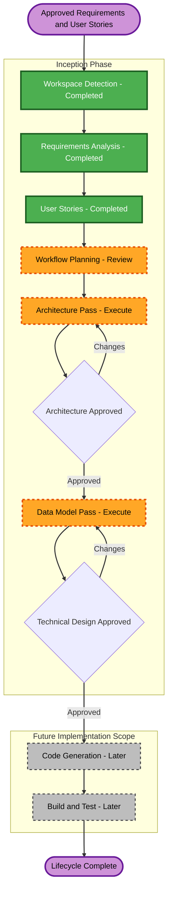

# Execution Plan

## Plan Status

- **Status**: Approved
- **Current lifecycle phase**: Inception
- **Current stage**: Workflow Planning
- **Requested deliverable**: One evaluator-facing Technical Design document
- **Target path**: `aidlc-docs/inception/application-design/technical-design.md`
- **Latest product truth**: `final.html`

## User-Directed Delivery Model

The Technical Design will be authored in two controlled passes within the same file:

1. **Architecture Pass**: Complete all architectural content, then stop for explanation, review, correction, and explicit approval.
2. **Data Model Pass**: Add the logical and physical data-model content to the approved architecture, align it to `final.html`, then stop for final review and explicit approval.

At the end, there will be one evaluator-facing Technical Design document. AIDLC state, audit, and planning files remain workflow records rather than evaluator deliverables.

## AIDLC Adaptation Note

AIDLC normally distributes design concerns across Application Design, Units Generation, Functional Design, NFR Design, and Infrastructure Design artifacts. The user has authorized consolidating the relevant outputs into a single Technical Design document. The workflow retains AIDLC traceability, content validation, plan tracking, and approval gates, but intentionally consolidates the default design artifact set.

## Detailed Analysis Summary

### Change Impact Assessment

- **User-facing changes**: Yes - VBCS dashboard, BOM detail, issue review, history, and advisory AI interactions.
- **Structural changes**: Yes - new integration, validation, persistence, API, UI, and AI responsibilities.
- **Data-model changes**: Yes - eight normalized ATP prototype tables for latest BOM data, components, runs, rules, findings, reviews, Advisory AI output, and diagnostics.
- **API changes**: Yes - ORDS interfaces for dashboard, BOM detail, UI refresh through OIC, validation, review, Advisory AI, and support workflows.
- **NFR impact**: Yes - authentication, authorization, encryption, redaction, observability, graceful AI degradation, timeouts, retries, and prototype-volume handling.

### Risk Assessment

- **Risk level**: High for delivery; the three-week prototype spans several Oracle services and an AI boundary.
- **Rollback complexity**: Moderate; phase one does not write back to Fusion PLM, which limits authoritative-data risk.
- **Testing complexity**: Complex; validation rules, graph cycles, history, permissions, integration failures, and AI degradation require distinct scenarios.
- **Primary control**: Preserve the Must scope and defer Could capabilities if they threaten the delivery constraint.

## Single-Document Outline

### Part I - Architectural Design

1. Purpose, scope, architectural drivers, and constraints
2. System context and external actors
3. Oracle component architecture
4. Component responsibilities and boundaries
5. End-to-end ingestion, UI refresh, validation, review, and AI flows
6. OIC, ATP, ORDS, VBCS, Fusion PLM, and AI interfaces
7. Validation engine, anomaly, scoring, and human-review boundaries
8. Authentication, authorization, encryption, secrets, and AI safety
9. Logging, correlation, error handling, retries, and graceful degradation
10. Deployment view, assumptions, decisions, risks, and known limitations

### Architecture Approval Gate

- Explain the architecture in concise sections.
- Resolve requested corrections in the same document.
- Do not begin the Data Model pass until the user explicitly approves Part I.

### Part II - Data Models

11. Data-model scope and modeling principles
12. Conceptual and logical entity model
13. Entity-relationship diagram and cardinalities
14. Simplified ATP table catalog with columns and data types
15. Primary keys, foreign keys, unique constraints, and preserved invalid-source fields
16. Latest BOM hierarchy and cycle-detection representation
17. Run, finding, review-status, health-score, BOM-level Advisory AI, selected-finding Advisory AI, and diagnostic models
18. Indexing, retention, lifecycle, security, and redaction considerations
19. Data traceability to requirements, stories, APIs, and architecture
20. Data assumptions, open implementation inputs, and limitations

### Final Technical Design Approval Gate

- Review the complete Architecture and Data Model content together.
- Resolve final corrections in the same document.
- Mark Technical Design complete only after explicit approval.

## Workflow Visualization



### Text Alternative

```text
Approved requirements and stories
  -> Workflow Planning approval
  -> Architecture pass
  -> Architecture approval gate
  -> Data Model pass
  -> Final Technical Design approval gate
  -> Future Code Generation and Build/Test only when separately authorized
```

## Phases and Activities

### Inception Phase

- [x] Workspace Detection - completed.
- [x] Reverse Engineering - skipped because the application is greenfield.
- [x] Requirements Analysis - completed and approved.
- [x] User Stories - completed and approved.
- [x] Workflow Planning - approved.
- [x] Application Design concerns - completed and approved in the Architecture pass.
- [x] Units Generation concerns - logical responsibility boundaries were consolidated into Part I; formal per-unit implementation artifacts remain future work.

### Consolidated Design Activities

- [x] NFR Requirements - approved NFR-001 through NFR-009 were used as design inputs.
- [x] NFR Design concerns - security, performance, observability, reliability, and AI boundaries were addressed at Part I architectural depth.
- [x] Infrastructure Design concerns - OIC, ATP, ORDS, VBCS, Fusion PLM, identity, secrets, and AI components were mapped at Part I logical depth.
- [x] Functional Design concerns - domain entities, relationships, state, refresh behavior, and constraints were consolidated into a `final.html`-aligned simplified Part II at evaluator-required Data Model depth; formal per-unit artifacts remain future work.
- [x] Architecture approval gate - passed on 2026-07-16.
- [ ] Final Technical Design approval gate - mandatory after Part II.

### Future Construction Phase

- [ ] Code Generation - required if the project continues to implementation, but outside the current documentation authorization.
- [ ] Build and Test - required after implementation, but outside the current documentation authorization.

### Operations Phase

- [ ] Operations - placeholder in AIDLC v1.0.1.

## Authoring and Validation Rules

- Modify only the single Technical Design deliverable during the two design passes.
- Preserve the approved requirements and user stories as authoritative inputs, as revised by the evaluator-approved `final.html`.
- Trace architectural decisions and data objects to relevant FR, NFR, and story identifiers.
- Label assumptions and unresolved implementation inputs instead of presenting them as approved facts.
- Validate every Mermaid diagram and provide a text alternative.
- Keep logical design separate from environment-specific credentials and secrets.
- Do not add automatic Fusion PLM write-back or other excluded capabilities.
- Stop at each approval gate and wait for explicit user authorization.

## Estimated Timeline Constraint

- The two design passes must fit within the overall three-week prototype schedule.
- No separate design-duration commitment is introduced by this plan.
- Review delays and Oracle environment access remain external dependencies.

## Success Criteria

- **Primary goal**: Produce one understandable and traceable Technical Design document covering architecture and data models.
- **Architecture quality gate**: Components, interfaces, flows, boundaries, NFRs, risks, and deployment context are understandable and approved.
- **Data-model quality gate**: Entities, eight normalized prototype tables, keys, relationships, constraints, latest hierarchy representation, run/finding/review history, scoring, BOM-level and finding-level AI data, refresh records, and diagnostics are understandable and approved.
- **Traceability**: The document maps design decisions to approved requirements and user stories.
- **Scope control**: The design remains achievable as a three-week prototype and preserves all explicit exclusions.
- **Final outcome**: The evaluator receives one approved Technical Design document.
